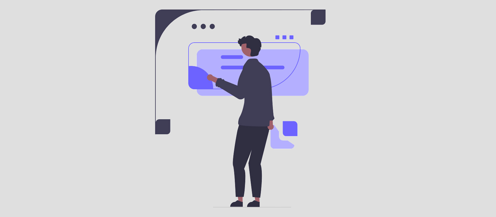
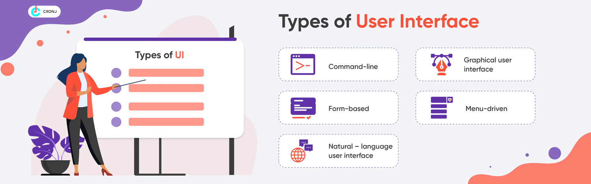
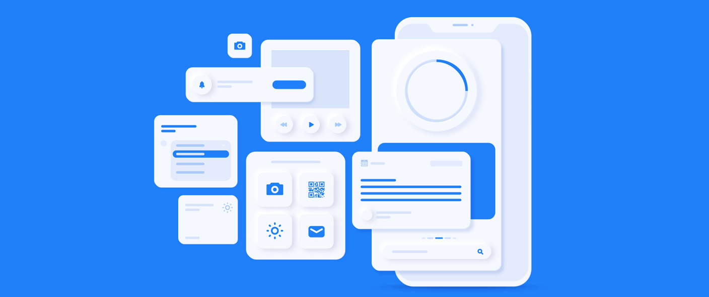
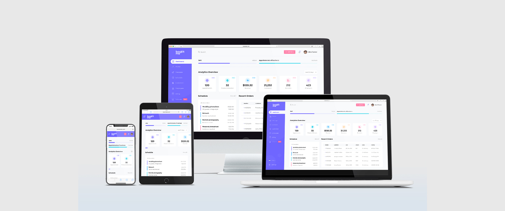

What is UI Design?

For years now, user interfaces and the uses to which they are put have been constantly evolving. The graphic design of these interfaces has to adapt to these changes and focus on user habits.

#### 🤓 **At the end of this lesson, you will know:**

✅ What a user interface is
✅ The role of the UI designer
✅ How UI design contributes to a better user experience

---

## What is a User Interface?
User interfaces are the point of interaction between the user and the digital product. An example would be the touch screen of a mobile phone. However, a user interface is not limited to graphical user interfaces; it can also be controlled by movement or voice.

Dialogue with the user can take place via a keyboard, a mouse, a screen, etc. Each of these elements has its own specific characteristics and must be designed to provide a good user experience. 
The user must be able to interact easily with a product via these elements, which involves thinking about the structure, appearance and nature of the content offered...

---

## User interface design
UI Design creates the **graphic environment** in which a user moves around a website, software or application: typography, colours, page layout grids, icons, buttons, etc. The UI designer designs all the screens through which users will navigate.

The UI designer ensures that the overall appearance of the product (website, video game, application, etc.) is **consistent**. They ensure that the various graphic elements are used in a consistent and appropriate manner. Their work involves thinking about **how information is displayed** and how **accessible** it is, and what means need to be put in place to **fluidify the user journey** and help them carry out their tasks while leaving them in control of their actions. The aim is to design an environment that users can explore without fear, because they are guided and reassured. Above all, the UI designer's work must help users to carry out their tasks, helping them to complete them easily and effortlessly!

[Source](https://gapsystudio.com/blog/what-is-responsive-web-design/)

The UI designer also ensures that the layout is **compatible with different media and screens**. They adapt the structure and appearance of the content to meet the specific requirements and constraints of the devices used by users. This requires a good knowledge of these media, as well as users' browsing habits on them.

[Source](https://dribbble.com/shots/2458792-Sign-Up)


It is important for the UI designer to consider the interactive part of screen design. Interaction design involves considering how pages and the elements within them interact. Animations and micro-interactions must add value by providing feedback to the user on their actions. Feedback** is an important aspect of interface design, indicating to the user that their action has been taken into account.

User interface design therefore focuses on the visual aspect of a product and is concerned with accessibility, responsiveness, efficiency and consistency.

>**10 Usability Heuristics for User Interface Design**
> Jakob Nielsen's 10 general principles of interaction design. They are called "heuristics" because they are general rules of thumb and not specific guidelines for use. &#x1F393; &nbsp; [https://www.nngroup.com/articles/ten-usability-heuristics/](https://www.nngroup.com/articles/ten-usability-heuristics/)

---

## UI Design & UX Design

While the **UX Designer defines the design axis and the process for improving the user experience**, the **UI Designer is responsible for bridging the gap between man and machine through the point of contact constituted by the user interface**. By proposing pleasant interfaces, in which the user navigates and moves easily, the UI designer contributes to a good user experience. The way in which things are represented graphically plays a major role in the user experience, so it's not something to be overlooked!
 
**UX and UI design are crucial in product design and both place people at the heart of their design processes**.

---

## ☝️ Summary
- User interfaces are the **point of contact between man and machine**.
- The UI designer designs the graphic aspect of an interface and contributes to the user experience. Like the UX designer, they **focus their design work on the human**.

---

## 💪 Challenge
Share a site or application in which you think UI design contributes effectively to the user experience and explain how.
