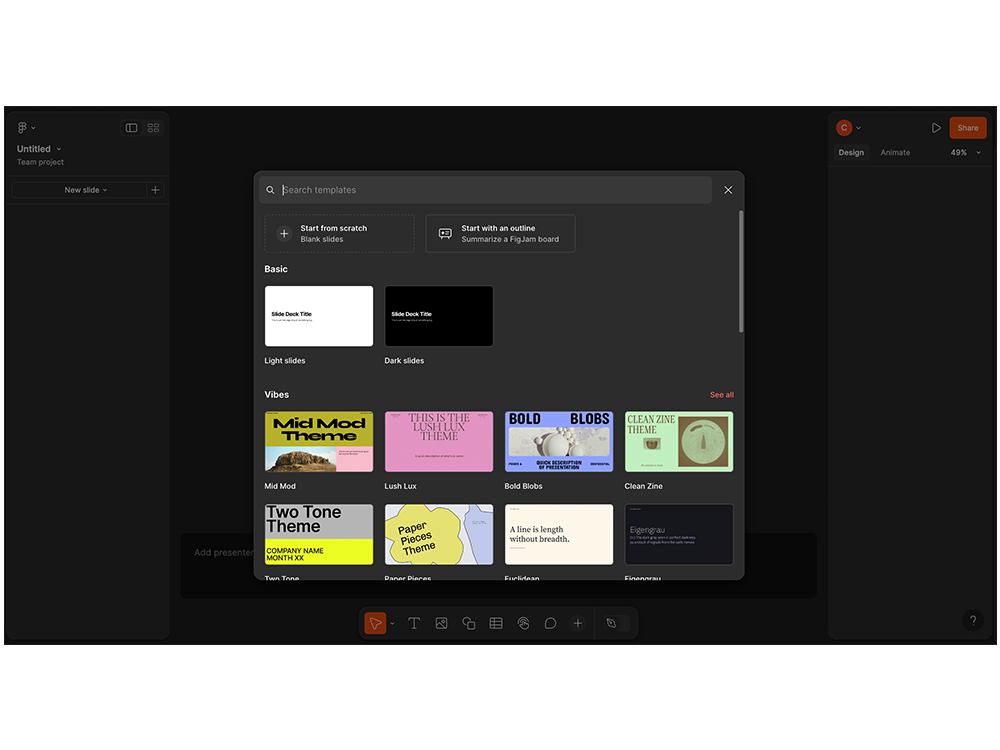
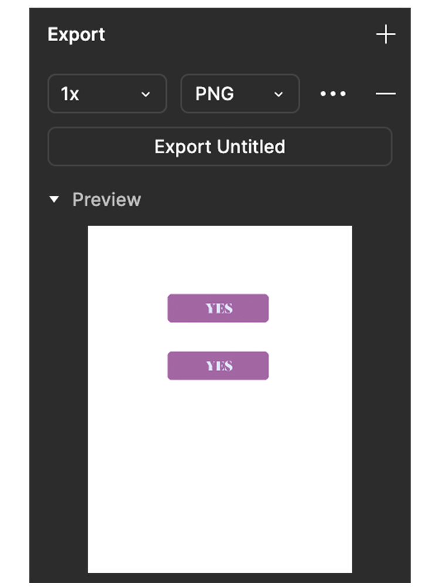

## Introduction 

Figma is one of the most widely used **prototyping** software packages on the market.

Using Figma, you'll be able to **design a site or application mock-up**, turn it into an interactive prototype, make presentations and even brainstorm in a team using Figjam.


# 🤓 At the end of this quest you'll know :

✅ What Figma is
✅ How the Figma interface is organised
✅ What tools make up a Figma work plan

---

## Discovering and setting up Figma

### Via browser or desktop application

Figma is generally used on a browser.
You can also download an application depending on your operating system (Mac or Windows) via this [page](https://www.figma.com/downloads/).

All you have to do is create an account with the email address of your choice, if you don't already have an account.


### Create your account with the Education plan
Figma offers various packages to meet the needs of teams and projects of all sizes. The Education plan allows students to benefit from the same features as a Figma Pro plan. In addition to the features of the basic plan, here's what it will offer you:


- Design
    Unlimited number of Figma files
Team libraries
Advanced prototyping

- Dev Mode
Show annotations
Advanced inspection
VS Code extension

- Administration
Unlimited number of versions in the history
Shared and private projects

To register with an Education plan, go to [this link](https://www.figma.com/education/). 

Once you have clicked on "Register", you will need to enter your role ("student"), the type of course you are taking (in your case, "bootcamp") and the school you are attending. Other information, such as your field of study and the purpose of your application, should also be provided. For example, you could explain that as part of your training, you will be working with various stakeholders on design files.

 

Once you've filled in all this information, you should automatically benefit from these new features!
Creating a project
### Your first project

Depending on your needs, there are several options available to you. Whether you're starting a project, creating small freehand models for brainstorming, or working from an existing project, the possibilities are endless.

Figma offers 3 options when you want to start a project.

>&#128276; &nbsp;Following an update, you may have either the old Figma interface or the new one. In the examples below, there are tabs to show you what the tools look like depending on your Figma interface.

### Project

 

 
Also known as the "design file", it is the most common version of a Figma file. After initialisation, it will redirect you to the basic Figma workspace.


### Figjam


Figjam is an interesting tool for brainstorming concepts.
It takes the form of a large grid on which you can work alone or in a team.
You can also add different types of graphic elements, such as shapes, stickers, drawings, imported images, post-it notes, etc.


### Importing files
 


You will sometimes work with existing projects.
Figma can handle certain file formats, such as :
- ```sketch``` (.sketch)
- ```figma``` (.fig)
- ```figjam``` (.jam)
- ```image``` (PNG, JPG, HEIC, or GIF)


---

### Teamwork

Figma is a collaborative working platform. It allows several people to work on the same project in real time.

When you need to work in a team, you can go to the left-hand side panel called "Teams".

In this section you can create your first team, or find the teams you have already created.

Once you have configured your team settings, you can create a new team project.


 


---

## Discovering the interface via a project

Let's take a look at how our interface breaks down when we create a new project.

Our workspace has 3 main sections:
- on the left, the panel for managing our layers
- in the centre, our workspace in which we will format our project
- on the right, another panel, used to manage the properties of the various elements making up our project, in the "design" section. The "prototype" section will be useful for setting up prototypes and adding interactivity between your pages and components.

 

 

---

### Overview of the basic tools

Let's take a closer look at the basic tools of our interface.

>&#128276; &nbsp;- In the previous version, the tools were located in the top bar of our workspace.
>- In the new version, they are in the bar at the bottom centre of your workspace. Access to the menu is still on the left, however.

#### Menu
 
 


It allows you to be quickly redirected to work in another project or another category.

It also provides quick access to various functions that you can implement and use for your project (libraries, widgets, text editing, vector import, etc.).


#### Selection and scale
 

 

As its name suggests, the ``Select'' function lets you select one or more elements of your project.

In this same section, the "Scale" function will be very useful if you need to resize several elements of your work proportionally at the same time.

On the new version of Figma, the Hand tool is also available for moving around your workspace without affecting the elements within it.

#### Frame, section and slice

 

The "frame" is the tool used to define the size of the work surface on which you are going to work. You can define it freely, or use pre-existing formats in your right-hand side panel, depending on your needs (mobile, tablet, desktop, etc.).

The "section" allows you to better organise the different parts of a project. It is also possible to link several sections together, to link flows between different parts of a prototype.

Slice is a powerful and versatile feature for exporting files. Its purpose is to select certain targeted elements of your project. This is particularly useful if you only need to export certain elements/details of your work.

#### Shapes

 

 

To create simple geometric shapes (circles, squares, etc.).
You can also use the drop-down list in this option to import images and videos.

#### Pen and pencil
 

 

As with Illustrator, these tools will be useful when you want to make precise vector lines, if you're using the pen, or free-form lines, if you're using the pencil.

#### Text

 


For creating new text elements.

#### Widgets, libraries
                                                               
A library allows you to reuse components and styles in your projects. You can also select the components and styles you want to share, publish them as a library and access the library from other files, in the same way as using libraries on Adobe CC.

A widget is a pre-made element that can help you design one of your projects. Depending on your needs, there are lots of different ways to use it, from small cards to tick lists.


 


#### Comments
 


As mentioned at the start of this quest, Figma is a platform where collaborative work is given pride of place. With comments, you can leave notes, comments and other useful remarks when working as a team.

---

## Figma Slides (Beta)

Figma Slides is a Figma feature that allows you to create presentations directly within the application.
It is particularly useful for designers, product teams and developers who want to create visual presentations without leaving their usual work environment.




>&#9654; &nbsp; [Watch on YouTube](https://www.youtube.com/watch?v=CdXliXtIjx0)

---

## Sharing and exporting

There are several ways to export and share your work.

### Share your work with other contributors

If you have started a project and would like to share it with your colleagues, simply click on the "Share" button in the top right-hand menu of your workspace.

 

 

You can then define your collaborators' rights and access to the project in a dedicated window.

### Share your work with a client

If you want to share your work with a client, particularly in the form of boards, you can do so via the "export" option.

To do this, go to your side panel via ``Export``.
 

 
Here you can define the file format (PNG, PDF, JPG or SVG).

You'll also be able to give it a suffix if required, target the export of one or more frames, and see a preview of what you're exporting.

---

## ☝️ Summary

Figma is a very powerful tool for creating complex models, from wireframes to high-fidelity prototypes.

It takes time and lots of practice to master this kind of tool.

If you want to find out more, there are lots of videos and tutorials available on the Figma website.

For example, you can watch [these short videos](https://www.youtube.com/playlist?list=PLXDU_eVOJTx6zk5MDarIs0asNoZqlRG23) which show more advanced concepts.
